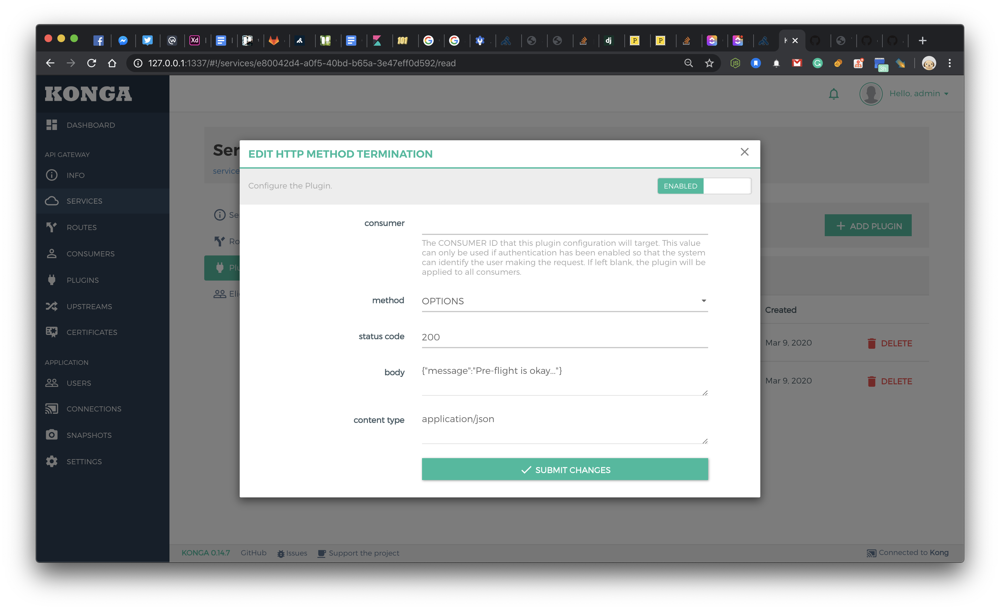

# Kong HTTP Request Termination

> Kong Terminate HTTP method and return response with status code.

## Deployment

```
./start.sh
```

## Using Plugin

### Create Service

```
curl 127.0.0.1:8001/services -d url=http://httpbin.org -d name=httpbin
```

### Add Route

```
curl 127.0.0.1:8001/services/httpbin/routes -d paths[]=/
```

### Call httpbin via Kong

```
curl 127.0.0.1/headers
{
  "headers": {
    "Accept": "*/*",
    "Cache-Control": "max-stale=0",
    "Host": "httpbin.org",
    "User-Agent": "curl/7.64.1",
    "X-Amzn-Trace-Id": "Root=1-5e61561b-db5f1a22104fc6fab89afc21",
    "X-Forwarded-Host": "127.0.0.1"
  }
}
```

### Enable Plugin

```
curl 127.0.0.1:8001/services/httpbin/plugins \
	-d name=http-method-termination \
	-d config.method=OPTIONS \
	-d config.status_code=200 \
	-d config.body={\"message\":\"yay\"}
```

### Call GET httpbin via Kong

```
curl -i 127.0.0.1/headers
HTTP/1.1 200 OK
Content-Type: application/json
Content-Length: 211
Connection: keep-alive
Date: Mon, 09 Mar 2020 11:19:40 GMT
Server: gunicorn/19.9.0
Access-Control-Allow-Origin: *
Access-Control-Allow-Credentials: true
X-Kong-Upstream-Latency: 541
X-Kong-Proxy-Latency: 35
Via: kong/2.0.1

{
  "headers": {
    "Accept": "*/*",
    "Host": "httpbin.org",
    "User-Agent": "curl/7.64.1",
    "X-Amzn-Trace-Id": "Root=1-5e66264c-6a1848826495cc10f6cd7429",
    "X-Forwarded-Host": "127.0.0.1"
  }
}
```

### Call OPTIONS httpbin via Kong

```
curl -i -w "\n" -XOPTIONS 127.0.0.1/headers
HTTP/1.1 200 OK
Date: Mon, 09 Mar 2020 11:19:14 GMT
Content-Type: application/json
Connection: keep-alive
Content-Length: 17
X-Kong-Response-Latency: 0
Server: kong/2.0.1

{"message":"yay"}
```

# Konga


